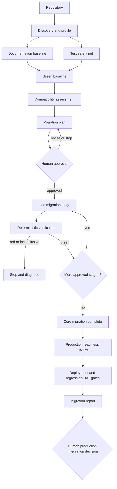

# Agentic Java Modernization

A vendor-neutral, evidence-driven method for modernizing established Java
applications with one capable coding agent, deterministic tools, CI, and human
approval gates.

## Release Status

v1.0 release candidate. The core workflow has been exercised against the public
[SpringBootSampleERP pilot](docs/case-studies/spring-boot-sample-erp.md). Review
and hosted validation are still required before tagging v1.0.0.

## The Problem

An old Java application can compile after a framework upgrade and still break
API contracts, persistence, transactions, serialization, security, configuration,
or operations. This project makes the current behavior and risks visible before
changing the platform, then advances through small, independently verified stages.

It is intended for maintainers and coding-agent users modernizing existing Java
or Spring applications. It does not promise autonomous, zero-risk migration,
guaranteed compatibility, or automatic production readiness.

## Lifecycle



The architecture and artifact contracts are explained in
[docs/architecture.md](docs/architecture.md).

## v1 Architecture

```text
one target repository
        +
one capable coding agent
        +
one reusable modernization skill
        +
deterministic tools and CI
        +
human approval gates
```

Agents analyze, propose, and implement bounded work. Builds, tests, CI, and
other deterministic systems verify. Humans approve risky transitions. v1 does
not introduce a team of specialized agents.

## Core Principles

- Discover the repository before changing production behavior.
- Capture observable behavior with meaningful characterization and regression tests.
- Record a green or explicitly accepted baseline before migration.
- Derive targets and intermediate stages from compatibility evidence; never force
  a universal Java or Spring Boot ladder.
- Execute one approved stage, inspect the entire diff, and stop while red.
- Keep business redesign and broad refactoring separate from platform migration.
- Treat coverage as a quality signal, not the objective. Approximately 80%
  meaningful line coverage may guide investment where realistic, but test counts
  and percentages do not replace protected critical flows.
- Distinguish core migration completion from production readiness.

## Artifacts Produced in a Target Repository

```text
README.md                         human onboarding and operations
AGENTS.md                         exact agent working rules and commands
.modernization/
├── REPOSITORY_PROFILE.md         concise current-state knowledge
├── TEST_BASELINE.md              tests, protected behavior, coverage, gaps
├── MIGRATION_PLAN.md             targets, stages, gates, branches, approvals
└── MIGRATION_REPORT.md           actual outcomes, evidence, readiness, risks
```

Templates are under
[`skills/agentic-java-modernization/assets/`](skills/agentic-java-modernization/assets/).
Remove irrelevant sections rather than shipping empty boilerplate.

## Core Migration Is Not Production Readiness

**Core Migration Complete** means the selected runtime/framework target was
reached through green approved stages. **Production Ready** additionally requires
applicable configuration/secrets, database delivery, CI, security, deployment,
observability, rollback, and residual business-test findings to be resolved or
accepted and representative deployment/regression evidence to be green.

Readiness findings use `BLOCKER`, `REQUIRED BEFORE PROD`, `RECOMMENDED`,
`DEFERRED`, and `NOT APPLICABLE`. Moving a password to an environment variable
does not rotate an exposed credential. Adding Flyway or Liquibase is not a
universal requirement and does not make existing-schema adoption automatic.

## Incremental Branching

For long-running work, the recommended conceptual model is:

```text
main/master                      current production truth
modernization/integration        future production candidate
modernization/<stage>            short-lived stage from the migration plan
```

Stage branches flow through the integration line and its CI/test environment.
Production changes are synchronized into that line regularly, followed by
reverification, so the final candidate is not based on an obsolete snapshot.
Merge versus rebase remains a repository/team decision. Short migrations may use
the repository's normal PR flow without adding a long-lived integration branch.

See [the branching guide](skills/agentic-java-modernization/references/branching.md).

## Install or Load the Skill

The portable package follows the public
[Agent Skills specification](https://agentskills.io/specification):

```text
skills/agentic-java-modernization/
```

Register that whole directory through your coding agent's current skill workflow;
the references and templates are part of the package. For local Codex development,
a source checkout may be linked without copying it:

```bash
mkdir -p ~/.codex/skills
ln -s "$(pwd)/skills/agentic-java-modernization" ~/.codex/skills/agentic-java-modernization
```

Run from this repository root. Inspect an existing destination rather than
overwriting it, then reload the agent if needed. For Claude Code, Cursor, IBM Bob,
or another capable agent, use its documented skill/context mechanism and retain
the same approval gates.

## Usage

If authorization is ambiguous, the skill defaults to analysis and does not
change runtime or framework versions.

### Analyze only

```text
Use the agentic-java-modernization skill to analyze this repository. Complete
discovery, create or update the repository profile, and assess documentation and
the test safety net. Do not plan or execute a migration.
```

### Plan only

```text
Use the current profile and test baseline to assess compatibility and produce a
repository-specific migration graph. Recommend targets and safe stopping points,
but do not execute any stage.
```

### Execute the next approved stage

```text
Execute only the next approved stage in .modernization/MIGRATION_PLAN.md. Inspect
the complete diff, run every defined verification gate, update evidence, and stop
before another stage.
```

### Review production readiness

```text
The core migration is complete. Assess production readiness and classify only
applicable findings. Record deployment/regression checks and gaps, but do not
merge, release, migrate data, or deploy without explicit authorization.
```

## Verification Philosophy

A migration stage is not complete because an agent says it is complete. It is
complete only when its repository-specific gates pass. Depending on risk, those
gates include Maven/Gradle build, unit and integration tests, characterization
and contract tests, comparable coverage, startup/smoke, packaging, dependency,
schema, migration-specific, and delivery checks. CI provides independent evidence
and must not be weakened merely to obtain green status.

## Optional Integrations

[OpenRewrite](skills/agentic-java-modernization/references/openrewrite.md) can
apply reviewable deterministic transformations after compatibility assessment,
stage approval, exact recipe/version/licensing review, and preferably a dry run.
It is not required and never replaces behavioral verification.

[IBM Bob](skills/agentic-java-modernization/references/ibm-bob.md) can be selected
for publicly documented analysis, testing, migration, and verification
capabilities. It is optional. No IBM-internal configuration, documentation,
repository information, prompts, credentials, or customer data belongs here.

## Repository Structure

```text
.
├── .github/
│   ├── PULL_REQUEST_TEMPLATE.md
│   └── workflows/validate.yml
├── docs/
│   ├── architecture.md
│   └── case-studies/spring-boot-sample-erp.md
├── scripts/validate_repository.rb
└── skills/agentic-java-modernization/
    ├── SKILL.md
    ├── agents/openai.yaml
    ├── assets/*.template.md
    └── references/*.md
```

## Contributing and Governance

See [CONTRIBUTING.md](CONTRIBUTING.md). With one maintainer, v1 encourages PRs
where practical and requires meaningful CI without an impossible second-person
approval. Multi-maintainer review rules and CODEOWNERS can be added when they
provide real enforcement value.

## License

Licensed under the [Apache License 2.0](LICENSE).
